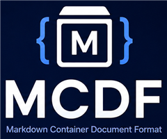

# The MCDF Showcase {#overview}



This document is an **MCDF container** — and it demonstrates every feature of
the format from the inside. What you are reading is plain Markdown in
`content.md`; everything else about this document (its metadata, structure,
integrity, signature, and history) lives beside it as ordinary YAML and JSON
files. No binary blobs, no proprietary framing:

```text
showcase/
  content.md          this text
  metadata.yaml       title, authors (with DIDs), provenance
  schema.yaml         required document structure
  manifest.json       SHA-256 of every member (canonical JSON)
  signatures/         detached JWS over the manifest
  audit.log           hash-chained history + signed checkpoint
  assets/             the image above
```

Open this container in **MCDF Studio** (or run `mcdf inspect` on it) and every
panel lights up.

## Structure that binds {#structure}

The heading of each section here carries an explicit id — like `{#structure}`
on this one. `schema.yaml` declares which sections this document type
*requires*, and validators (and Studio's Structure panel) check the binding
live. Delete this section and the document stops conforming.

## Integrity you can see {#integrity}

`manifest.json` lists the SHA-256 of every member in canonical (RFC 8785)
JSON. Change one character anywhere — even in the image — and verification
pinpoints exactly which file drifted:

```sh
mcdf verify showcase/
mcdf validate showcase/ --profile integrity
```

In Studio, the Manifest panel shows a live dot per file: green (matches),
amber (edited, needs rebuild), red (missing).

## Trust that breaks loudly {#trust}

A detached JWS in `signatures/` signs the canonical manifest, so it covers
every hash — and therefore every byte — of this document. The signer is
identified by a `did:key`, no certificate authority required. Try the flagship
demo in Studio:

1. Open this container — the trust chip is **green**.
2. Type one character — it flips **red**: the signature no longer covers what
   you see.
3. Rebuild the manifest — still red: the manifest changed under the signature.
4. Re-sign with your own key (one click to generate) — **green** again, now
   with *your* DID.

Tamper-evidence is not a report you request; it is a state you watch change.

## Confidentiality when you need it {#confidentiality}

The same container can carry AES-256-GCM encrypted members, with the content
key HPKE-wrapped to each recipient's X25519 `did:key` in
`encryption/policy.yaml`. This showcase stays in the clear so you can read it —
encrypt your own copy with:

```sh
mcdf encrypt showcase/ --recipient did:key:z6LS...
```

## History that cannot be rewritten {#audit}

`audit.log` is an append-only, hash-chained timeline: each entry commits to
the previous one, so truncation or reordering is detectable, and a signed
checkpoint pins the chain head. This document's own log already records its
creation and signing — check it:

```sh
mcdf audit showcase/
```

## Viewing and shipping {#viewing}

A deterministic renderer produces the bytes you publish — sanitized HTML with
a strict CSP and a provenance stamp (source hash + renderer version), or plain
text. Same input, same output, every time:

```sh
mcdf render html showcase/ -o showcase.html
```

> **The point:** everything you just read about is *inspectable with a text
> editor*. A document format for everyone — humans, tools, and AI — with
> integrity, trust, confidentiality, and history as optional layers, not
> lock-in.
